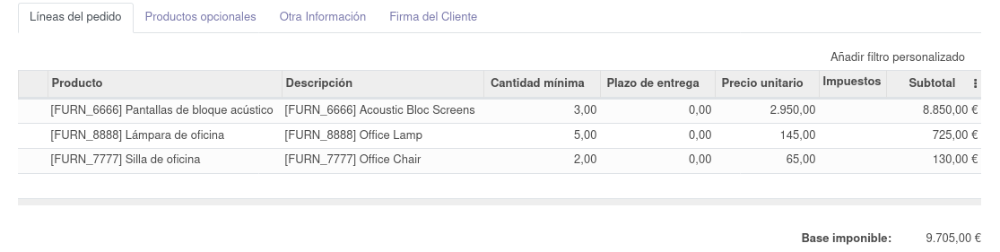
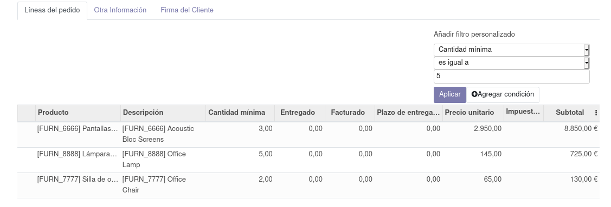
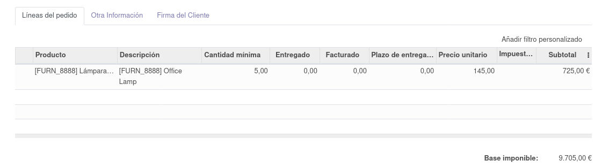

# One2many Advanced Filter (BETA needs huge refactoring)

Allows to filter on fields of type one2many

## 👩‍💻 Usage

Install the module and look for an one2manyfield in a form view.

  

Click on the button over the table to add conditions. It uses the same Control Panel of the paginator component.

### Result after Apply filters:

Show the filter list of records.

## 👏 Contributing

Pull requests and 🌟 stars are always welcome.
For major changes, please open an issue first to discuss what you would like to change.

## 📩 Contact

racielperdomo1993@gmail.com

Twitter @Raikiri93

Linkedin /in/rpgomez

